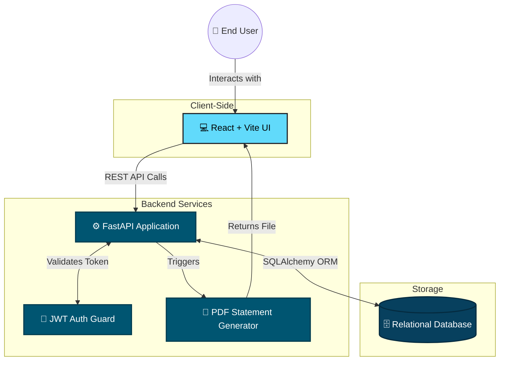

# 🏦 NextGen-Finance


NextGen-Finance is a modern, full-stack banking simulation platform. It provides a secure environment for users to create accounts, manage their finances, and perform everyday banking operations like deposits, withdrawals, and transfers, all backed by a robust and scalable architecture.

---

## 🏗️ System Architecture

The platform uses a decoupled architecture, separating the client-side user interface from the server-side logic and database operations.



---

## ✨ Core Features

### 👤 For Users
* **Secure Onboarding:** Role-based registration with secure password hashing and JWT authentication.
* **Account Management:** Open new bank accounts and securely update profile information with OTP verification.
* **Financial Transactions:** Execute real-time money transfers, deposits, and withdrawals.
* **Transaction Ledger:** View a complete, tamper-proof history of all account activity.
* **Downloadable Statements:** Generate and download instant PDF account statements.

### 🛡️ For Administrators
* **User Control:** View and manage all registered users on the platform.
* **Lifecycle Management:** Oversee the status of all bank accounts.

---

## 🛠️ Technology Stack

* **Backend Environment:** Python, FastAPI
* **Database & ORM:** SQLite (Easily configurable to PostgreSQL), SQLAlchemy
* **Authentication:** JSON Web Tokens (JWT), bcrypt for password hashing
* **Frontend Interface:** React, Vite, standard CSS

---

## 🚀 Quick Start Guide

Follow these simple steps to run the project on your local machine.

### 1. Start the Backend Server

1. **Clone the repository and enter the directory:**
   ```bash
   git clone https://github.com/Raysharma/NextGen-Finance.git
   cd NextGen-Finance
   ```
2. **Install Python dependencies:**
   ```bash
   pip install -r requirements.txt
   ```
3. **Configure the environment:**
   * Create a file named `.env` in the root directory.
   * Copy the contents of `.env.example` into your new `.env` file and update any necessary values.
4. **Launch the FastAPI application:**
   ```bash
   uvicorn app.main:app --reload
   ```
   *The API will be live at `http://localhost:8000`. You can view the automatic API documentation at `http://localhost:8000/docs`.*

### 2. Start the Frontend Application

1. **Open a new terminal window and navigate to the frontend folder:**
   ```bash
   cd frontend
   ```
2. **Install Node modules:**
   ```bash
   npm install
   ```
3. **Configure the frontend environment:**
   * Create a file named `.env` in the `frontend` folder.
   * Copy the contents of `.env.example` into it. Ensure `VITE_API_URL` points to your running backend (e.g., `VITE_API_URL=http://localhost:8000`).
4. **Start the development server:**
   ```bash
   npm run dev
   ```
   *The web app will typically be available at `http://localhost:5173`.*

---

## 📁 Project Structure

```text
NextGen-Finance/
├── app/                  # Backend Application Logic
│   ├── main.py           # FastAPI entry point
│   ├── models.py         # SQLAlchemy database models
│   ├── routes/           # API endpoints (auth, accounts, transactions)
│   └── utils.py          # Helper functions (PDF generation, OTP)
├── frontend/             # React Application Interface
│   ├── src/              # React components and pages
│   ├── package.json      # Frontend dependencies
│   └── vite.config.js    # Vite configuration
├── requirements.txt      # Python dependencies
└── README.md             # Project documentation
```

---

## ☁️ Deployment

* **Backend:** Can be easily deployed to platforms like Render, Railway, or Heroku. Ensure you set your `.env` variables in the deployment dashboard. Use `uvicorn app.main:app --host 0.0.0.0 --port $PORT` as the start command.
* **Frontend:** Optimized for deployment on Vercel or Netlify. Set the build command to `npm run build` and the output directory to `dist`.